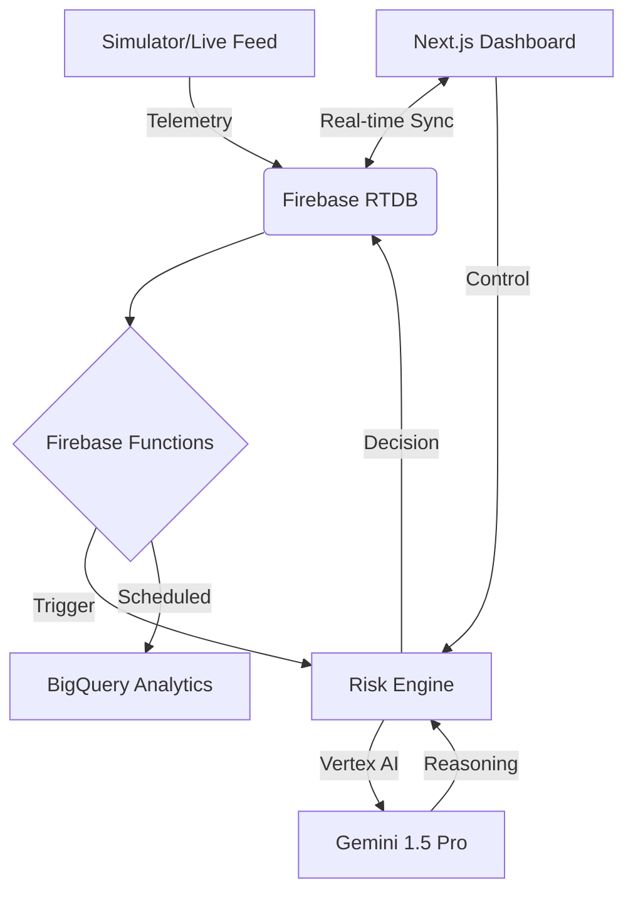

# 🛡️ SENTINEL ENHANCED
### AI-Powered Supply Chain Resilience & Autonomous Orchestration

**SENTINEL ENHANCED** is a production-grade Supply Chain Management (SCM) system designed for the Google Developers Group India Hackathon. It combines real-time global telemetry, Gemini 1.5 Pro reasoning, and autonomous logistics orchestration to transform reactive logistics into proactive resilience.

---

## 🚀 Key Features

- **🧠 Gemini AI Reasoning**: Every risk assessment and rerouting decision is backed by a plain-English justification from Gemini 1.5 Pro, explaining *why* a route was changed (e.g., "Predicted NH48 flooding will cause a 14-hour delay; rerouting via SH12 saves ₹4,200 in fuel").
- **🛰️ Real-time Disruption Detection**: Monitors global weather hazards, traffic congestion, and port strikes using Google Maps and Weather APIs.
- **📉 Cascade Analysis**: Detects how a single delayed shipment impacts downstream inventory levels and warehouse capacity in real-time.
- **📦 Operational Control Center**: A premium Next.js 14 dashboard for managing Shipments, Inventory, Warehouses, and Vendors with high-fidelity visualizations.
- **⚡ Autonomous Recovery**: Intelligent agents that automatically trigger rerouting protocols for shipments crossing high-risk thresholds.

---

## 🛠️ Tech Stack

- **Frontend**: Next.js 14 (App Router), Tailwind CSS, Framer Motion, Lucide, Recharts.
- **Microservices**: Node.js, TypeScript, Express.
- **AI/ML**: Google Vertex AI (Gemini 1.5 Pro).
- **Database**: Firebase Realtime DB (Live Telemetry), BigQuery (Historical Analytics).
- **Orchestration**: Docker, Firebase Functions (Triggers & Scheduled Crons).
- **Maps**: Google Maps JavaScript API (Geospatial Visualization).

---

## 🏗️ Architecture



---

## 🚦 Getting Started

### 1. Prerequisites
- Node.js 18+
- Docker (Optional for orchestration)
- Google Cloud Project with Vertex AI enabled
- Firebase Project

### 2. Environment Setup
Copy the example environment file and fill in your API keys:
```bash
cp .env.example .env
```

### 3. Installation
Install dependencies for the frontend and all microservices:
```bash
# Frontend
cd frontend && npm install

# Services (Repeat for all in /services)
cd services/risk-engine && npm install
```

### 4. Running the Platform
Launch the development environment:
```bash
# Using Docker (Recommended)
docker-compose up --build

# Manually (Terminal 1: Frontend)
npm run dev --prefix frontend

# Manually (Terminal 2-5: Services)
npm run dev --prefix services/risk-engine
# ... repeat for weather-service, inventory-service, etc.
```

---

## 📈 Dashboard Preview
- **`/`**: Operations Control Center (KPIs & Regional Risk Map)
- **`/shipments`**: Interactive Tracking Hub
- **`/inventory`**: Real-time Stock Monitoring
- **`/alerts`**: Incident Control Center

---

## 📜 License
Built for the **Google Developers Group India Hackathon**. All Rights Reserved.

---

**SENTINEL** - *Predict the Unpredictable.*
